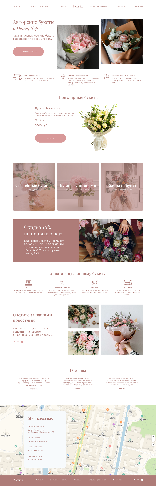

# Вёрстка макета для Марафона-2021 от [htmlacademy](https://github.com/htmlacademy), который я благополучно пропустил :-\

Ссылка на макет в Figm'е [Марафона-2021-botanica](https://www.figma.com/file/HdU7VTV6uNdHyuvDrffeKC/%D0%9C%D0%B0%D1%80%D0%B0%D1%84%D0%BE%D0%BD-2021?node-id=0%3A1)

Ссылка на мою готовую [вёрстку](https://pacman-ou.github.io/Marathon-2021-botanika/)

## TO-DO
* мобильная адаптация
* иконки в футере
* поведение при наведении

